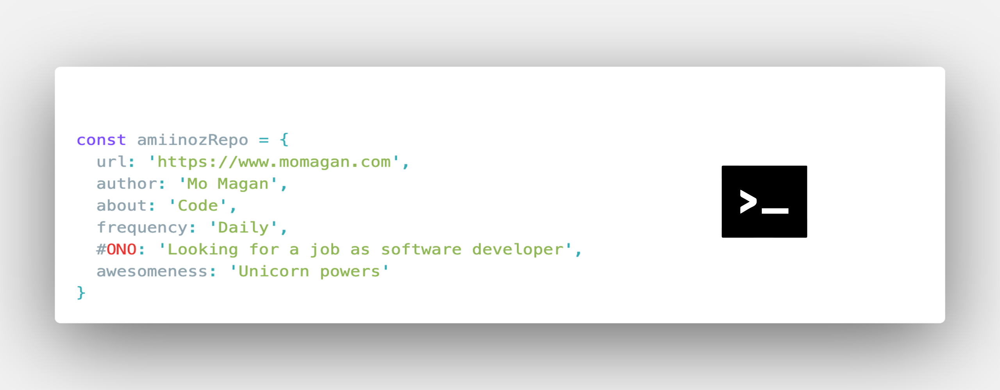

<!--  -->
<!--[][amiinozheader]-->
### Hi there, I'm Mo Magan - aka Amiinoz [website] 👋

## I'm a Front end developer and UX designer 
- 🔨  I’m currently working on client projects 
- ⚡ Fun fact: I love UX Design, Soccer & photography 

### Connect with me:

[][twitter]
[][linkedin]
[][instagram]

 

### Languages and Tools:

[][webdevplaylist]
[][webdevplaylist]
[][cssplaylist]
[][cssplaylist]
[][jsplaylist]
[][reactplaylist]
[][webdevplaylist]
[][webdevplaylist]
[][webdevplaylist]
[][webdevplaylist]
[][webdevplaylist]
[][webdevplaylist]
[][webdevplaylist]
[][webdevplaylist]
[][webdevplaylist]
[][webdevplaylist]
[][webdevplaylist]

 
 

---

### 📗  Latest Blog posts I am reading
<!-- BLOG-POST-LIST:START -->
<!-- BLOG-POST-LIST:END -->

---

  ### 📈  My github stats
 |   |    |
| ------------- |:-------------:| -----:|

[website]: https://momagan.com
[twitter]: https://twitter.com/dev_mos
[instagram]: https://www.instagram.com/mo.b.nice
[linkedin]: https://www.linkedin.com/in/momagan/
[webdevplaylist]: #
[jsplaylist]: #
[cssplaylist]: #
[reactplaylist]: #
[amiinozheader]:https://github.com/Amiinoz

